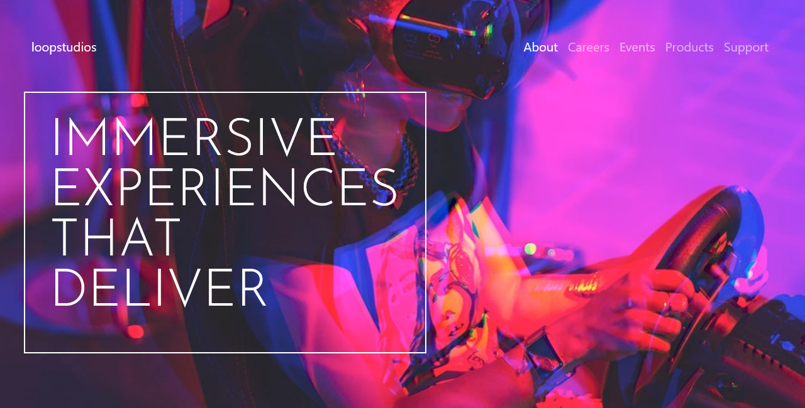

# Frontend Mentor - Loopstudios landing page solution

This is a solution to the [Loopstudios landing page challenge on Frontend Mentor](https://www.frontendmentor.io/challenges/loopstudios-landing-page-N88J5Onjw). Frontend Mentor challenges help you improve your coding skills by building realistic projects. 

## Table of contents

- [Overview](#overview)
  - [The challenge](#the-challenge)
  - [Screenshot](#screenshot)
  - [Links](#links)
  - [Built with](#built-with)
  - [What I learned](#what-i-learned)
  - [Continued development](#continued-development)
- [Author](#author)

## Overview

### The challenge

Users should be able to:

- View the optimal layout for the site depending on their device's screen size

### Screenshot

### Links

- Solution URL: [https://www.frontendmentor.io/solutions/loopstudios-landing-page-S5kCawHsm9]
- Live Site URL: [https://keithgaines.github.io/loopstudios/]

### Built with

- Semantic HTML5 markup
- CSS custom properties
- CSS Grid
- Mobile-first workflow

### What I learned

Building a landing page with Bootstrap components allowed me to learn how to make a webpage responsive using the "srcset" attribute for images that adapts to different screen resolutions. Additionally, I gained experience with overlapping elements and positioning properties in CSS to create dynamic layouts. Overall, this project was a valuable learning experience that improved my web development skills and gave me a better understanding of techniques used for creating visually appealing and responsive designs.

### Continued development

As I progress in my web development skills, I am keen to enhance my proficiency in implementing responsive images. I aim to explore different techniques for optimizing image performance on a diverse range of devices and screen sizes, such as using attributes like "srcset" and "sizes" to deliver the appropriate image resolution for each device. Additionally, I wish to explore lazy-loading techniques for images, which can reduce page loading times and bandwidth usage. By broadening my knowledge of responsive images, I hope to create visually appealing websites that offer a seamless and efficient user experience across all devices.

## Author

- Website - [Keith Gaines](https://keithgaines.github.io)
- Frontend Mentor - [@keithgaines](https://www.frontendmentor.io/profile/keithgaines)

